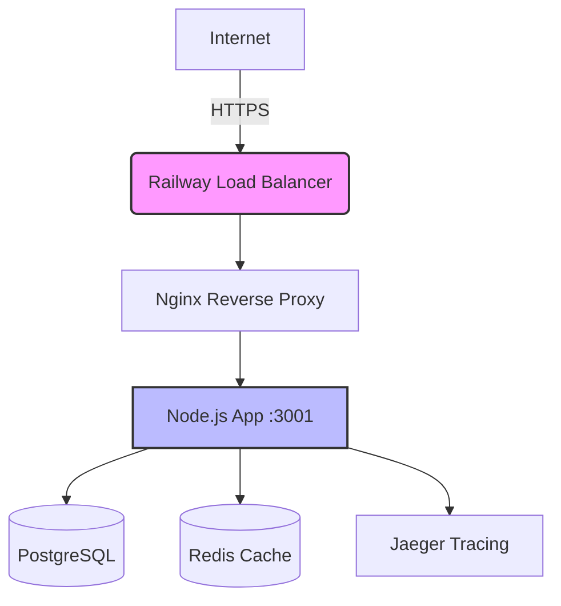

# Cloud Deployment Showcase

[](https://github.com/PkLavc/cloud-deployment-showcase/actions)
[](https://railway.app)
[](https://www.docker.com)
[](LICENSE)
[](https://www.hashicorp.com/resources/what-is-infrastructure-as-code)

## Project Overview

A comprehensive demonstration of production-ready cloud deployment patterns for modern web applications. This project showcases enterprise-grade deployment strategies including multi-cloud deployment, container orchestration, infrastructure as code, security best practices, monitoring, and CI/CD workflows.

## Architecture

### Visual Infrastructure Map


### Engineering Impact & National Interest
| Component | Implementation | Industry Value |
| :--- | :--- | :--- |
| **High Availability** | Horizontal Scaling + Auto-healing | Minimizes digital service downtime |
| **Security Architecture** | Zero-Trust & Nginx Hardening | Protects sensitive data against cyber threats |
| **Observability** | Jaeger Distributed Tracing | Rapid incident response and performance optimization |
| **Automation** | Full CI/CD via GitHub Actions | Accelerates software delivery lifecycle (SDLC) |

### Components

- **Railway Platform**: Cloud hosting with automatic scaling and managed services
- **Nginx**: Reverse proxy, load balancer, and security gateway
- **PostgreSQL**: Managed database service with automatic backups
- **Redis**: Managed cache and queue service for high performance
- **Jaeger**: Distributed tracing and observability platform
- **Docker**: Containerization for consistent deployment environments

## Deployment Guide

### Prerequisites

- Railway account (https://railway.app)
- GitHub repository
- Domain name (optional)

### Step 1: Railway Setup

1. **Create Railway Project**
   ```bash
   # Connect your GitHub repository
   git clone https://github.com/PkLavc/cloud-deployment-showcase.git
   cd cloud-deployment-showcase
   railway login
   railway init
   ```

2. **Add Services**
   ```bash
   # Add PostgreSQL
   railway add postgresql

   # Add Redis
   railway add redis

   # Add Jaeger (optional, for tracing)
   railway add jaeger
   ```

### Step 2: Environment Variables

Set the following environment variables in Railway dashboard:

```env
# Database (auto-provided by Railway)
DATABASE_URL=${{Postgres.DATABASE_URL}}

# Redis (auto-provided by Railway)
REDIS_URL=${{Redis.REDIS_URL}}

# Webhook Secrets (generate secure random strings)
STRIPE_WEBHOOK_SECRET=whsec_your_secure_stripe_secret
PAYPAL_WEBHOOK_SECRET=your_secure_paypal_secret
GITHUB_WEBHOOK_SECRET=your_secure_github_secret

# OpenTelemetry
OTEL_SERVICE_NAME=event-driven-integration-service
JAEGER_ENDPOINT=${{Jaeger.JAEGER_ENDPOINT}}

# Application
NODE_ENV=production
PORT=3001
```

### Step 3: Database Migration

```bash
# Run migrations on Railway
railway run npm run prisma:migrate

# Generate Prisma client
railway run npm run prisma:generate
```

### Step 4: Deploy

```bash
# Deploy to Railway
railway up
```

Railway will automatically build and deploy using the provided Dockerfile.

## Configuration Files

### Dockerfile (Production Optimized)

```dockerfile
# Build stage
FROM node:18-alpine AS builder

WORKDIR /app

COPY package*.json ./
RUN npm ci --only=production

COPY . .
RUN npm run build

# Production stage
FROM node:18-alpine AS production

WORKDIR /app

# Install dumb-init for proper signal handling
RUN apk add --no-cache dumb-init

# Copy built application
COPY --from=builder /app/dist ./dist
COPY --from=builder /app/node_modules ./node_modules
COPY --from=builder /app/package*.json ./
COPY --from=builder /app/prisma ./prisma

# Create logs directory
RUN mkdir -p logs

# Switch to non-root user
USER node

EXPOSE 3001

# Use dumb-init to handle signals properly
ENTRYPOINT ["dumb-init", "--"]
CMD ["npm", "run", "start:prod"]
```

### Nginx Configuration

```nginx
events {
    worker_connections 1024;
}

http {
    upstream app_backend {
        server app:3001;
    }

    server {
        listen 80;
        server_name your-domain.com;

        # Security headers
        add_header X-Frame-Options "SAMEORIGIN" always;
        add_header X-XSS-Protection "1; mode=block" always;
        add_header X-Content-Type-Options "nosniff" always;
        add_header Referrer-Policy "no-referrer-when-downgrade" always;
        add_header Content-Security-Policy "default-src 'self' http: https: data: blob: 'unsafe-inline'" always;

        # Health check endpoint
        location /health {
            proxy_pass http://app_backend;
            proxy_set_header Host $host;
            proxy_set_header X-Real-IP $remote_addr;
            proxy_set_header X-Forwarded-For $proxy_add_x_forwarded_for;
            proxy_set_header X-Forwarded-Proto $scheme;
        }

        # API endpoints
        location / {
            proxy_pass http://app_backend;
            proxy_set_header Host $host;
            proxy_set_header X-Real-IP $remote_addr;
            proxy_set_header X-Forwarded-For $proxy_add_x_forwarded_for;
            proxy_set_header X-Forwarded-Proto $scheme;

            # Timeout settings
            proxy_connect_timeout 60s;
            proxy_send_timeout 60s;
            proxy_read_timeout 60s;
        }

        # Logs
        access_log /var/log/nginx/access.log;
        error_log /var/log/nginx/error.log;
    }
}
```

### Railway Configuration

```toml
[build]
builder = "dockerfile"

[deploy]
healthcheckPath = "/health"
healthcheckTimeout = 300
restartPolicyType = "ON_FAILURE"
restartPolicyMaxRetries = 10
```

## Security Measures

### Environment Variables
- All secrets stored securely in Railway
- No hardcoded credentials in code
- Environment-specific configurations

### Network Security
- Railway's built-in firewall
- HTTPS enabled by default
- Private networking between services

### Application Security
- Input validation and sanitization
- HMAC signature verification for webhooks
- Rate limiting (Railway built-in)
- Security headers via Nginx

## Monitoring & Observability

### Health Checks
- Public endpoint: `https://your-app.railway.app/health`
- Checks database connectivity and memory usage
- Railway monitors and restarts unhealthy instances

### Logs Access
```bash
# View application logs
railway logs

# View specific service logs
railway logs --service postgresql
```

### Tracing
- Jaeger UI accessible via Railway dashboard
- Distributed tracing for request flows
- Performance monitoring and debugging

## CI/CD Pipeline

### GitHub Actions Workflow

```yaml
name: Deploy to Railway

on:
  push:
    branches: [ main ]
  pull_request:
    branches: [ main ]

jobs:
  test:
    runs-on: ubuntu-latest
    steps:
      - uses: actions/checkout@v3
      - name: Setup Node.js
        uses: actions/setup-node@v3
        with:
          node-version: '18'
          cache: 'npm'
      - run: npm ci
      - run: npm run build
      - run: npm run test

  deploy:
    needs: test
    runs-on: ubuntu-latest
    if: github.ref == 'refs/heads/main'
    steps:
      - name: Deploy to Railway
        uses: railwayapp/railway-deploy@v1
        with:
          railway-token: ${{ secrets.RAILWAY_TOKEN }}
```

## Cost Estimation

### Railway Pricing (Approximate)
- **Application**: $5/month (hobby plan)
- **PostgreSQL**: $5/month
- **Redis**: $3/month
- **Jaeger**: Free tier
- **Bandwidth**: Included in plans

**Total Monthly Cost**: ~$13/month

## Scaling Strategy

### Vertical Scaling
- Increase Railway plan for more CPU/memory
- Upgrade database instances

### Horizontal Scaling
- Railway handles automatic scaling
- Multiple app instances behind load balancer

### Database Scaling
- Connection pooling via Prisma
- Read replicas for high traffic

## Troubleshooting

### Common Issues

**Database Connection Failed**
```bash
# Check Railway variables
railway variables

# Test connection
railway run npm run prisma:studio
```

**Webhook Signature Invalid**
- Verify webhook secrets in Railway dashboard
- Check provider webhook configuration

**Health Check Failing**
```bash
# Check logs
railway logs

# Manual health check
curl https://your-app.railway.app/health
```

## Deployment Checklist

- [ ] Railway project created
- [ ] Services added (PostgreSQL, Redis)
- [ ] Environment variables configured
- [ ] Database migrated
- [ ] Application deployed
- [ ] Health check passing
- [ ] Domain configured (optional)
- [ ] Webhook endpoints tested
- [ ] Monitoring set up

## Alternatives Considered

### AWS EC2 + RDS
**Pros**: More control, familiar AWS ecosystem
**Cons**: More complex setup, higher maintenance

### Render
**Pros**: Simple deployment, managed services
**Cons**: Limited customization, vendor lock-in

### Railway (Chosen)
**Pros**: Developer-friendly, automatic scaling, integrated services
**Cons**: Less control than self-managed infrastructure

## Learning Outcomes

This deployment showcases:
- Cloud platform deployment strategies
- Infrastructure as Code basics
- Security best practices for production
- Monitoring and observability setup
- CI/CD pipeline implementation
- Cost optimization for small applications

## Author

**Patrick - Computer Engineer** To view other projects and portfolio details, visit:
[https://pklavc.github.io/projects.html](https://pklavc.github.io/projects.html)

---

*This showcase demonstrates practical cloud deployment skills for production applications.*
